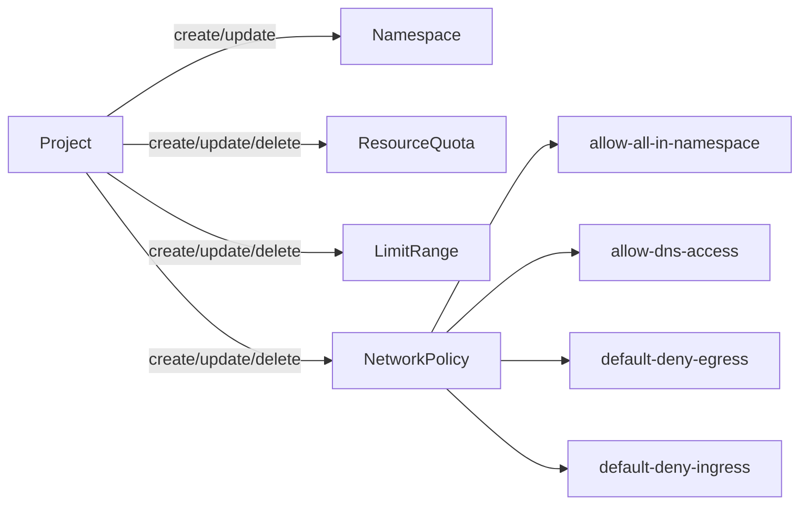

# Kubernetes-operator


Kubernetes operator for maintaning 
projects, 
namespaces, 
resourcequotas, 
limitranges, 
networkpolicies, RBAC permissions 





Add release version as git tag
```
git tag 0.0.3
git push origin --tags
```

HELM

```
helm repo add  djkormo-project https://djkormo.github.io/k8s-project-operator/

helm repo update

helm search repo project-operator  --versions

helm install project-operator djkormo-project/project-operator \
  --namespace project-operator --values charts/project-operator/values.yaml --create-namespace --dry-run

helm upgrade project-operator djkormo-project/project-operator \
  --namespace project-operator --values charts/project-operator/values.yaml


helm uninstall project-operator  --namespace project-operator 
```